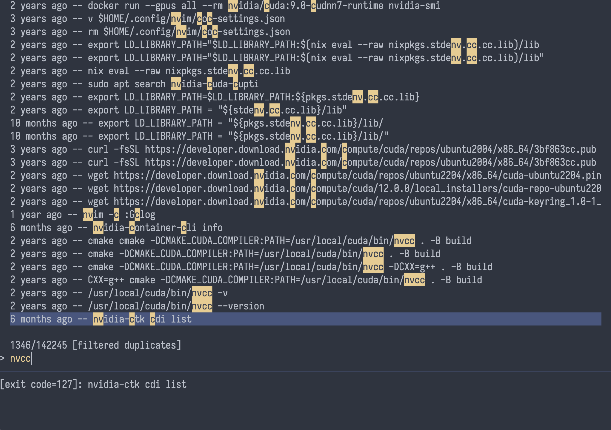

# osh-oxy

<p align="center">
  
</p>

**Note:** This is a very simple (and still crude) tool designed primarily for my personal workflows. It's intentionally kept minimal and focused. It provides simple fuzzy history search using our own history format, based on our Python [one-shell-history](https://github.com/dkuettel/one-shell-history).

Currently it offers two commands to append and search:

- append to bosh history file
- search all \*.bosh history files with skim

## installation (nix flake)

build with nix:

```
nix build github:iff/osh-oxy
```

using osh-oxy with flakes:

```
osh-oxy = {
  url = "github:iff/osh-oxy";
  inputs.nixpkgs.follows = "nixpkgs";
  flake = true;
}
```

## setup

I organise my osh files per host:

```
.osh
├── active
│   ├── host.bosh
│   ├── name.bosh
│   └── xyz.bosh
└── local.bosh -> active/host.bosh
```

## search command

The search command accepts the following arguments:

```
osh-oxy search --folder <FOLDER> [--query <QUERY>] [--session_id <SESSION_ID>] [--filter <FILTER>]
```

**Required arguments:**

- `--folder <FOLDER>`: The current working directory to use for filtring

**Optional arguments:**

- `--query <QUERY>`: Initial search query (defaults to empty string if not provided)
- `--session_id <SESSION_ID>`: Filter results to a specific shell session ID. When provided and the `session_id` filter is active, only commands from this session will be shown
- `--filter <FILTER>`: Initial filter mode to apply (defaults to none if omitted). Valid values:
  - `duplicates`: Hide duplicate commands, showing only unique entries
  - `session_id`: Filter by the provided session ID
  - `folder`: Filter to commands run in the same folder
- `--show_score`: Show fuzzy matcher score after command

The filter can be cycled through at runtime using the Tab key (none → duplicates → session_id → folder → none).

## example zsh integration

Note that `--starttime` is a timestamp in milliseconds.

```
function __osh {
    osh-oxy $@
}

autoload -U add-zsh-hook

function __osh_ts {
    printf '%.0f' $((EPOCHREALTIME * 1000))
}

function __osh_before {
    local command=''${1[0,-2]}
    if [[ $command != "" ]]; then
        __osh_current_command=(
            --starttime $(__osh_ts)
            --command $command
            --folder "$(pwd)"
        )
    fi
}
add-zsh-hook zshaddhistory __osh_before

function __osh_after {
    local exit_code=$?
    if [[ ! -v __osh_session_id ]]; then
        __osh_session_id=$(uuidgen)
    fi
    if [[ -v __osh_current_command ]]; then
    __osh_current_command+=(
            --endtime $(__osh_ts)
            --exit-code $exit_code
            --machine "$(hostname)"
            --session $__osh_session_id
        )
        __osh append-event $__osh_current_command &!
        unset __osh_current_command
    fi
}
add-zsh-hook precmd __osh_after

function __osh_search {
    if [[ -v __osh_session_id ]]; then
        __osh_session_id=$(uuidgen)
    fi
    BUFFER=$(__osh ui --folder=$(pwd) --query=$BUFFER --session-id=$__osh_session_id)
    CURSOR=$#BUFFER
    zle reset-prompt
}
zle -N __osh_search
bindkey '^r' __osh_search
bindkey -M vicmd '^r' __osh_search
bindkey -M viins '^r' __osh_search
```
